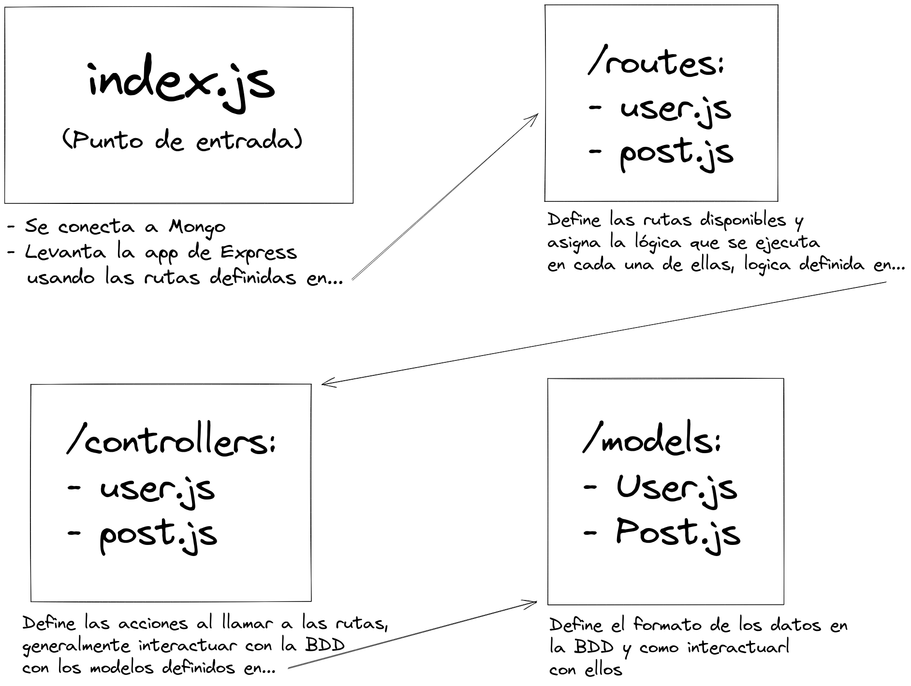

# Relación entre entidades con Mongo y Mongoose

Este ejemplo es un pequeño backend que permite crear y leer dos entidades: `user` (usuario) y `post` (artículo escrito por un usuario). 

## Pre-requisitos

- Tener NodeJS instalado
- Una base de datos MongoDB levantada en local en el puerto 27017.

Si la base de datos no está levantada en local, se debe indicar la URL de conexión en el método `connect()` de `index.js`.

## Funcionamiento

Si no se ha hecho antes, instalar las dependencias con:
```bash
$ npm install
```

Luego, levantar el servidor con:
```bash
$ npm start
```

## Esquema del backend

